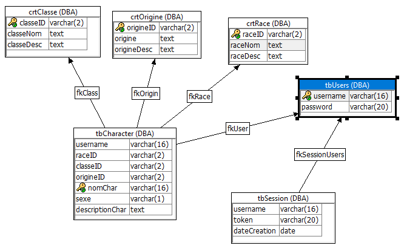

# Présentation du projet

## Objectif

Fournir un outil simple pour la création de personnages de jeu de rôle pour des parties de Dungeons and Dragons ou autre jeu de rôle.

## Fonctionnalités principales

- Système de races, classes et autres caractéristiques d'une liste prédéfinie mais modifiable.
- Sauvegarde des personnages créés.
- Partage facile de ton personnage via un lien.
- Liste de tous les personnages créés par la communauté.
- Système d'authentification.
- Page montrant certaines statistiques.

## Fonctionnalités supplémentaires

- Connexion par token lié à la fenêtre.
- Modification ou suppression d'un personnage déjà créé une fois connecté.
- Pages montrant les profils des utilisateurs et de ses personnages créés.

## Membres

Carlos RUIZ HERRERA -> D34DPlayer

Simon NOLF 		    -> SimonNolf

Nicolas MARTOU      -> Hotmailnico

Gabrielle CRUZ      -> JhandarTheUnhallowed 

## Tables

- **tbUsers :** Contient les infos de connexion des utilisateur.
- **tbSession** : Crée un lien entre un token généré côté client et un compte, avec la date de création pour qu'il soit temporaire.
- **crtClasse, crtOrigine, crtRace** : Contiennent des informations plus précises sur des caractéristiques des personnages, notamment une courte description.
- **tbCharacter** : représente un personnage, avec son propriétaire, son nom et ses autres caractéristiques (race, classe, origine, sexe et une description personnelle).

## Webservices

`Beaucoup des services api retournent un code status pour que le js client sache comment réagir, un document avec leurs significations standarisées est disponible dans le dossier principal.`

`À moins qu'un nom soit mis à côté du nom du service, il sera considéré comme commun au groupe. `

`Les réponses json sont représentées comme des objets js.`

- Services de base:

  - root(:url) -> renvoie la page si elle existe, l'index sinon.

    Réponse: page HTML

  - js(:url) -> renvoit le fichier js à partir d'un nom (avec extension).

    Réponse: fichier js

  - css(:url) -> idem mais pour le css.

    Réponse: fichier css

  - image(:url) -> idem mais pour les fichiers multimédia.

    Réponse: fichier image

- Services d'inscription:

  - loginService(:user, :password, :token) `RUIZ` -> création de lien temporaire entre le token généré par le js client et un utilisateur.

    Réponse: JSON [{status}]

  - verifyToken(:token) -> vérifie si un token est valide et n'est pas périmé.

    Réponse: JSON [{status}]

  - logout(:token) -> efface le lien entre le token donné et le compte.

    Réponse: page HTML index

  - registerService(:user, :password) -> créé un compte avec ces détails.

    Réponse: JSON [{status}]

  - 

- Services d'obtention de données :

  - username(:token) -> renvoie le nom de l'utilisateur associé au token.

    Réponse: JSON [{status, username}]

  - membre() `MARTOU` -> renvoie la quantité de comptes créés.

    Réponse: JSON [{nbr}]

  - liste() `MARTOU` -> renvoie une liste des personnages créés, avec quelques caractéristiques importantes.

    Réponse: JSON [{nom, username, race, class}]

  - getProfile(:user, :token) ->renvoie une liste des personnages créés par ce compte, avec un status différent si propriétaire.

    Réponse: JSON [{status, username, nom, race, classe}]

  - stats(:colonne) -> donne la proportion de comptes avec ces valeurs, en fonction de la colonne donnée (race, origine, classe et sexe).

    Réponse: JSON [{categ, cmpt}]

- Services du système de création de personnages:

  - SuppressionService(:name, :token) `NOLF` -> efface un personnage, tant que l'utilisateur qui le demande soit sont propriétaire.
  
    Réponse: JSON [{status}]
  
  - getChar(:name, :token) `RUIZ` -> renvoie les caractéristiques d'un personnage.
  
    Réponse: JSON [{status, name, username, race, raceDesc, classe, classeDesc, origine, origineDesc, sexe, description}]
  
  - race() `CRUZ` -> renvoie une liste des races disponibles et ses détails.

    Réponse: JSON [{rId, rNom, rDesc}]
    
  - classe() `CRUZ` -> idem pour les classes.
  
    Réponse: JSON [{clId, clNom, clDesc}]
    
  - origine()  `CRUZ` -> idem pour les origines.
  
    Réponse: JSON [{ordId, org, orgDesc}]
    
  - registrePerso(:rId, :orgId, :clId, :nom, :genre, :desc, :token) `CRUZ` -> inscrit un nouveau personnage.
  
    Réponse: JSON [{status}]
  
  - modifierPerso(:rId, :orgId, :clId, :nom, :genre, :desc, :token) -> modifie un personnage existant, tant que celui qui effectue la demande soit le propriétaire.
  
    Réponse: JSON [{status}]
